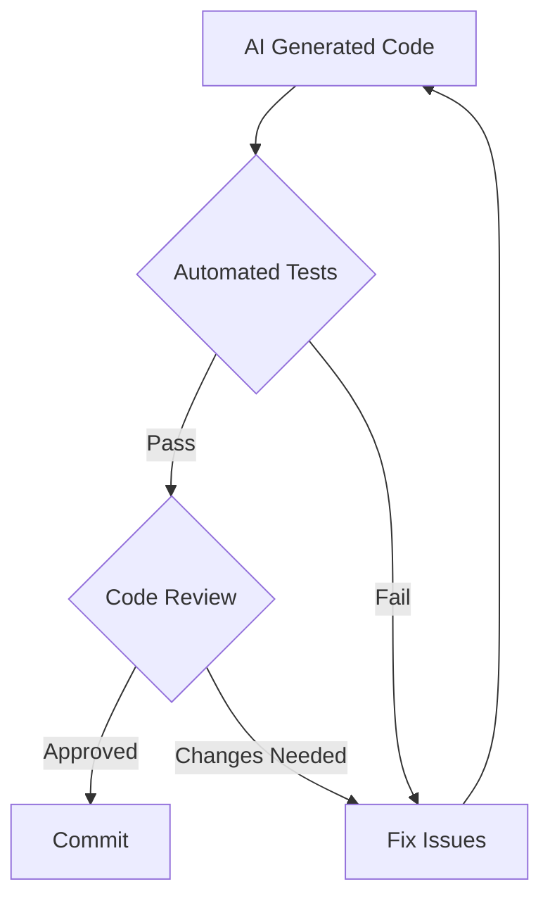

# Context Engineering Framework Workflow

## Overview
A systematic approach to working with AI that leverages the 4 D's (Delegation, Description, Discernment, Diligence) to achieve consistent, high-quality results.

---

## The Framework Components

### 1. Context Files (CLAUDE.md / PROJECT.md)
Persistent context that provides AI with:
- Project overview and goals
- Tech stack and conventions
- Coding standards
- Business domain knowledge
- Current sprint objectives

### 2. Command Structure
Organized prompts for common tasks:
- `defin_task.md` - Create and document initial task requirements
- `design_task.md` - Create and document new task requirements
- `refine_task.md` - Analyze & enhance task
- `plan_task.md` - Transform task into execute
- `execute_task.md` - Execute task


### 3. Workflow Stages

---

## Stage 1: Context Initialization

### Setting Up Your Project Context

```markdown
# PROJECT.md

## Project: Inclusively Success Enablers Framework

### Overview
Microsoft Teams application for managing disability accommodations

### Tech Stack
- Backend: Go 1.21, Gin framework
- Frontend: React 18, TypeScript
- Database: PostgreSQL
- Deployment: Azure

### Conventions
- RESTful APIs
- Repository pattern for data access
- Service layer for business logic
- Comprehensive error handling

### Current Sprint
- Implement Teams SSO
- Add accommodation request workflow
- Create analytics dashboard
```

---

## Stage 2: Task Planning

### Breaking Down Complex Tasks

**Input**: High-level requirement  
**Output**: Structured implementation plan

### The Planning Prompt Template:

```markdown
Given the context in PROJECT.md, create an implementation plan for:
[TASK DESCRIPTION]

Break this down into:
1. Discrete, testable steps
2. Dependencies between steps
3. Validation criteria for each step
4. Risk factors and mitigations

Format as numbered checklist with time estimates.
```

### Example Output:
```markdown
## Implementation Plan: Teams SSO Integration

1. [ ] Research Teams authentication flow (30 min)
   - Review Microsoft documentation
   - Identify required endpoints
   - Note token formats

2. [ ] Create auth service structure (45 min)
   - Define interfaces
   - Set up file structure
   - Add to dependency injection

3. [ ] Implement token validation (2 hours)
   - Parse JWT tokens
   - Verify signatures
   - Extract claims
   - Test with mock tokens

[continues...]
```

---

## Stage 3: Execution

### Step-by-Step Implementation

**For each planned step:**

1. **Provide Context**
   ```markdown
   Current step: [Step from plan]
   Previous steps completed: [List]
   Dependencies available: [List]
   ```

2. **Execute with Constraints**
   ```markdown
   Implement [specific feature] following:
   - Existing patterns in codebase
   - Error handling conventions
   - Testing requirements
   - Security best practices
   ```

3. **Validate Output**
   - Does it compile/run?
   - Are tests passing?
   - Does it follow conventions?
   - Are edge cases handled?

---

## Stage 4: Review and Iteration

### Quality Assurance Loop



### Review Checklist:
- [ ] Functionality correct
- [ ] Edge cases handled  
- [ ] Security validated
- [ ] Performance acceptable
- [ ] Documentation complete
- [ ] Tests comprehensive

---

## Stage 5: Knowledge Capture

### Continuous Improvement

After each task:

1. **Update Context Files**
   - New patterns discovered
   - Decisions made
   - Lessons learned

2. **Refine Commands**
   - What prompts worked well?
   - What needed clarification?
   - Create reusable templates

3. **Document Gotchas**
   - Framework quirks
   - API limitations
   - Workarounds

---

## Practical Example: Building a Feature

### Task: Add User Preferences to Teams App

#### Step 1: Plan
```bash
AI: "Create implementation plan for user preferences feature"
```

Output:
1. Database schema for preferences
2. API endpoints (GET/PUT /preferences)
3. React preference component
4. Teams storage integration
5. Migration script

#### Step 2: Execute First Step
```bash
AI: "Create PostgreSQL schema for user preferences table with userId, theme, notifications, accessibility settings"
```

#### Step 3: Validate
```bash
AI: "Review the schema for completeness, add indexes for performance, ensure GDPR compliance"
```

#### Step 4: Continue
Repeat for each planned step

#### Step 5: Integration Test
```bash
AI: "Create end-to-end test that verifies preference persistence across Teams sessions"
```

---

## Command Templates

### 1. Dispatch Task Command
```markdown
# Purpose: Delegate work effectively

Analyze this task and determine:
1. What should AI do completely
2. What needs human oversight
3. What requires human implementation

Task: [DESCRIPTION]
Context: [RELEVANT INFORMATION]
Constraints: [TIME, QUALITY, SECURITY]
```

### 2. Plan Task Command
```markdown
# Purpose: Decompose complex work

Create a step-by-step plan for:
[TASK]

Include:
- Prerequisites
- Implementation steps
- Testing approach
- Rollback plan
```

### 3. Execute Step Command
```markdown
# Purpose: Implement specific functionality

Implement: [SPECIFIC STEP]
Context: [PREVIOUS STEPS]
Requirements: [DETAILED SPECS]
Validation: [SUCCESS CRITERIA]
```

### 4. Review Output Command
```markdown
# Purpose: Quality assurance

Review this code for:
1. Correctness
2. Edge cases
3. Performance
4. Security
5. Maintainability

Code: [CODE TO REVIEW]
Context: [INTENDED PURPOSE]
```

---

## Tips for Success

### 1. Start Small
- Begin with simple automation
- Build confidence
- Learn AI's capabilities

### 2. Iterate on Prompts
- First attempt rarely perfect
- Refine based on output
- Save successful patterns

### 3. Maintain Context
- Keep PROJECT.md updated
- Document decisions
- Share knowledge with team

### 4. Trust but Verify
- Always review output
- Run tests
- Check edge cases
- Validate security

### 5. Learn from Interactions
- What works well?
- What causes confusion?
- How can prompts improve?

---

## Measuring Success

### Metrics to Track

1. **Velocity Improvement**
   - Tasks completed per sprint
   - Time to implement features
   - Bug reduction rate

2. **Quality Metrics**
   - Test coverage increase
   - Code review findings
   - Production incidents

3. **Team Adoption**
   - Developers using framework
   - Prompts shared/reused
   - Knowledge base growth

---

## Common Pitfalls to Avoid

### ❌ Over-Delegation
Don't delegate critical thinking or architecture decisions

### ❌ Under-Specification
Vague prompts = vague results

### ❌ Skipping Validation
Always verify AI output before production

### ❌ Context Drift
Keep context files current with project evolution

### ❌ Tool Lock-in
Focus on principles, not specific tools

---

## Getting Started Checklist

- [ ] Create PROJECT.md for your codebase
- [ ] Set up command templates folder
- [ ] Try framework on small feature
- [ ] Document what works
- [ ] Share learnings with team
- [ ] Iterate and improve

---

## Conclusion

The Context Engineering Framework transforms AI from a code completion tool into a true engineering partner. By providing rich context, structured workflows, and continuous validation, you can achieve:

- **3-5x faster feature development**
- **Higher code quality and consistency**
- **Better knowledge preservation**
- **Reduced cognitive load**

Start small, iterate often, and let the framework evolve with your needs.